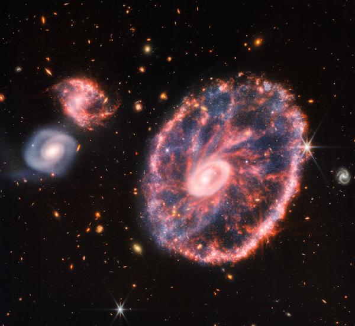
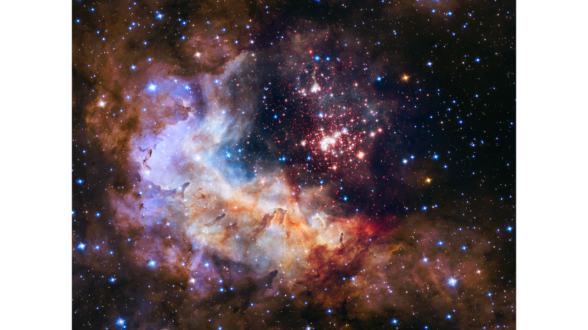

# Introduction

The aim of this project is to build a machine learning model to classify stellar objects as stars, galaxies, and quasars based on spectral characteristics. Stars are luminous bodies of plasma held together by gravity, like our own Sun. Galaxies are vast systems containing billions of stars, gas, and dust. The Milky Way, the galaxy we reside in, is one of hundreds of billions of galaxies which are observable in our universe. Quasars (short for quasi-stellar objects) are among the most energetic and distant objects in the universe, powered by supermassive black holes at their centers. One of the primary tools astronomers use to classify these objects is photometry. Photometry is the measurement of the intensity of light across different wavelengths, or filters. The five photometric filters used in this project (u, g, r, i, z) capture brightness across ultraviolet, green, red, near-infrared, and infrared wavelengths respectively, measured in units of magnitude. A second key measurement is redshift, the stretching of light to longer wavelengths as an object moves away from the observer, which serves as a proxy for distance. The central goal for this project is to determine whether photometric measurements alone are sufficient to accurately classify stellar objects, or whether redshift is necessary to achieve meaningful classification accuracy. 

<center>


The Cartwheel Galaxy
</center>

## Inspiration and Motive

Growing up, I spent weeks every summer at my grandparents’ home on Vashon Island. With little light pollution, we would spend almost every night sitting on the deck or around the fire and look at the stars. I always wondered what I was actually seeing, whether a given point of light was a star in our own galaxy or something incomprehensibly further away. That question is what motivates this project. The five photometric filter measurements (u, g, r, i, z) represent the light we capture from Earth across different wavelengths. Redshift, by contrast, requires spectroscopic measurement and tells us how fast an object is moving away from us, serving as a proxy for distance. Obtaining redshift measurements is significantly more resource-intensive than photometry alone, so understanding whether it is truly necessary for accurate classification has real practical implications in astronomy.

<center>

Around the Fire on Vashon Island
</center>

## Data Description

The dataset used in this project is the "Stellar Classification Dataset - SDSS17", obtained from Kaggle. The data consists of 100,000 observations collected by the Sloan Digital Sky Survey (SDSS), a large-scale astronomical survey that has cataloged hundreds of millions of celestial objects since its launch in 2000. Each observation includes 17 feature columns and one class column identifying the object as a STAR, GALAXY, or QSO (quasar). Of the 17 features, 9 are administrative or observational identifiers with no intrinsic physical information about the object and were excluded from analysis. Two additional columns, right ascension (alpha) and declination (delta), represent sky coordinates of the telescope pointing rather than physical properties of the object itself and were also excluded. Notably, spec_obj_ID was excluded specifically because observations sharing the same ID are guaranteed to share the same class, which would constitute data leakage. The six features retained as predictors are the five photometric filter measurements (u, g, r, i, z) and redshift. A small number of observations contained placeholder values of -9999 in the u, g, and z columns, indicating missing data in the SDSS pipeline. These observations were removed prior to analysis. A random sample of 5,000 observations was drawn from the cleaned dataset for modeling purposes.

<center>



(Hubble Spots Fireworks in Westerlund2)

</center>

## Project Outline

This project proceeds in five stages. We begin with an exploratory data analysis to understand the structure, distributions, and relationships within the data, examining each predictor individually and stratified by class to build intuition before modeling. Second, we split the data into training and testing sets and establish two preprocessing recipes, one including all six predictors and one omitting redshift, in order to directly compare the contribution of redshift to classification performance. Third, we fit and tune seven classification models (K-Nearest Neighbors, Linear Discriminant Analysis, Quadratic Discriminant Analysis, Elastic Net, Decision Tree, Random Forest, and Boosted Tree) using 10-fold cross-validation, evaluating each on both the full and reduced recipes. Fourth, we compare all models by their cross-validation ROC AUC, select the two best-performing models, and evaluate them on the held-out test set using ROC AUC, accuracy, ROC curves, and confusion matrices. Finally, we draw conclusions about the role of redshift in stellar classification and discuss possibilities for future research, including whether photometry alone may be sufficient for objects at lower redshift values.

<center>


(Active Quasar Illustration)

</center>

# Exploratory Data Analysis

## Loading and Tidying Data

We begin by loading the packages needed for data manipulation, modeling, and visualization. 

```{r, message = F}
# Loading libraries
library(tidyverse)
library(tidymodels)
library(corrplot)
library(ggthemes)
library(kableExtra)
library(dplyr)
library(discrim)
library(kknn)
library(themis)
```

Next, we load the raw Stellar Classification dataset, sourced from the Sloan Digital Sky Survey (SDSS).

```{r}
# Reading in data
stellar_data <- read.csv("star_classification.csv")
```

### Cleaning and Preprocessing

We retain only the columns relevant to our analysis: the five photometric filter measurements (`u`, `g`, `r`, `i`, `z`), `redshift`, and the response variable `class`. The SDSS dataset encodes missing photometric values as `-9999.00`, so we remove any observations where `u`, `g`, or `z` take that value. We also convert `class` to a factor, since it is our response variable. 

```{r}
# Cleaning
stellar_data <- stellar_data%>%
  dplyr::select(u, g, r, i, z, redshift, class) %>%
  filter(u > -9999, g > -9999, z > -9999)

# Ensuring class is a factor
stellar_data$class <- as.factor(stellar_data$class)
```

We can check class distribution and summary statistics to get an initial sense of the data, as well as confirm there are no duplicate rows.

```{r}
# Checking distribution of class
table(stellar_data$class)

# Summary Statistics of Data
summary(stellar_data)

# Checking for duplicates
sum(duplicated(stellar_data))
```

The cleaned dataset contains 99,989 observations across three classes: GALAXY (59,445; 59.45%), STAR (21,593; 21.60%), and QSO (18,961; 18.96%). The classes are moderately imbalanced, with galaxies making up nearly three-fifths of the data. This is worth keeping in mind during modeling, as a naive classifier could achieve approximately 59% accuracy simply by predicting GALAXY every time. 

### Sampling

Due to the large size of the full dataset, we draw a random sample of 5,000 observations for exploratory analysis and model training. This keeps computation manageable while preserving the overall structure of the data.

```{r}
# Set seed for reproducibility
set.seed(123)

# Selecting a random sample
stellar_sample <- stellar_data %>% 
  sample_n(5000)

# Summary statistics of sample
summary(stellar_sample)
```

## Describing Predictors

Our dataset includes six predictors: five photometric filter measurements and one spectroscopic measurement. 

**Photometric Filters**

The SDSS captures the brightness of each object across five wavelength bands, each corresponding to a different region of the electromagnetic spectrum:

- `u` (ultraviolet, about 354 nm)

- `g` (green, about 477 nm)

- `r` (red, about 623 nm)

- `i` (near-infrared, about 763 nm)

- `z` (infrared, about 913 nm)

Each value is recorded as an astronomical magnitude. That is, they are on a logarithmic scale where lower values indicate a brighter object. Together, these five bands describe an object's spectral energy distribution, essentially its "color profile" across the optical spectrum. Since stars, galaxies, and quasars emit and absorb light differently across wavelengths, these filter values carry strong discriminatory power for classification.

**Redshift**

Redshift measures how much light from an object has been stretched toward longer (redder) wavelengths as a result of the expansion of the universe. A higher redshift value indicates the object is moving away from us more rapidly and is therefore more distant. This predictor is especially informative for distinguishing QSOs (quasars), which tend to reside at cosmological distances and exhibit very high redshifts. Stars in our own galaxy, by contrast, have redshifts near zero.

## Visual EDA

### Ultraviolet Filter in Photometric System

```{r}
# Creating Histogram of u
u_hist <- ggplot(stellar_sample, aes(x=u)) +
  geom_histogram(binwidth = .5, fill = "plum3", color = "black") +
  ggtitle("Histogram of Ultraviolet Filter in the Photometric System") +
  labs(x = "Ultraviolet Filter in the Photometric System") +
  theme_minimal()

u_hist
```

The ultraviolet filter (`u`) follows an approximately bell-shaped distribution center around magnitude 23, with a slight right skew and a range spanning from roughly 13 to 30. The smooth, unimodal shape suggests relatively consistent UV brightness across the sample, with most objects falling in the mid-to-faint range of the SDSS detection window.

### Green Filter in the Photometric System

```{r}
# Creating Histogram of g
g_hist <- ggplot(stellar_sample, aes(x=g)) +
  geom_histogram(binwidth = .5, fill = "palegreen3", color = "black") +
  ggtitle("Histogram of Green Filter in the Photometric System") +
  labs(x = "Green Filter in the Photometric System") +
  theme_minimal()

g_hist
```

The green filter (`g`) shows a less symmetric distribution, with a noticeable local peak around magnitude 18 before dipping and rising again to its main peak near magnitude 22. This irregular shape likely reflects the mixture of object classes in the sample. Brighter objects such as stars contribute to the lower-magnitude shoulder, while fainter galaxy population drives the dominant peak. 

### Red Filter in the Photometric System

```{r}
# Creating Histogram of r
r_hist <- ggplot(stellar_sample, aes(x=r)) +
  geom_histogram(binwidth = .5, fill = "tomato3", color = "black") +
  ggtitle("Histogram of Red Filter in the Photometric System") +
  labs(x = "Red Filter in the Photometric System") +
  theme_minimal()

r_hist
```

Similar to the green filter, the red filter (`r`) exhibits a bimodal tendency, with a secondary peak around magnitude 17-18 and a main peak near 21. The distribution is right-skewed with a moderate tail, suggesting a subset of objects that are notably fainter in red light relative to the bulk of the sample.

### Near Infrared Filter in the Photometric System

```{r}
# Creating Histogram of i
i_hist <- ggplot(stellar_sample, aes(x=i)) +
  geom_histogram(binwidth = .5, fill = "steelblue3", color = "black") +
  ggtitle("Histogram of Near Infrared Filter in the Photometric System") +
  labs(x = "Near Infrared Filter in the Photometric System") +
  theme_minimal()

i_hist
```

The near-infrared filter (`i`) is more symmetric and bell-shaped than the previous bands, centered around magnitude 19. There is a subtle bump on the left shoulder around magnitude 17, but overall the distribution is cleaner, suggesting the `i` band captures brightness more uniformly across object types.

### Infrared Filter in the Photometric System

```{r}
# Creating Histogram of z
z_hist <- ggplot(stellar_sample, aes(x=z)) +
  geom_histogram(binwidth = .5, fill = "rosybrown1", color = "black") +
  ggtitle("Histogram of Infrared Filter in the Photometric System") +
  labs(x = "Infrared Filter in the Photometric System") +
  theme_minimal()

z_hist
```

The infrared filter (`z`) has its main peak near magnitude 19, but displays a noticeably wider and more irregular spread than the `i` band, with a heavier right tail. The broader shape may reflect greater variability in how different object classes emit in the near-infrared, hinting that z could contribute complementary information to classification. 

### Redshift

```{r}
# Creating Histogram of redshift
redshift_hist <- ggplot(stellar_sample, aes(x=redshift)) +
  geom_histogram(binwidth = .25, fill = "salmon", color = "black") +
  ggtitle("Histogram of Redshift") +
  labs(x = "Redshift") +
  theme_minimal()

redshift_hist
```

Redshift is heavily right-skewed, with the vast majority of observations concentrated near zero and a long tail extending past 6. The near-zero spike is driven by stars in our own galaxy, which have negligible cosmological redshift, while the gradual decay through moderate values (about 0.1-1.0) reflects the galaxy population, and the sparse high-redshift tail corresponds to distant QSOs. The distribution suggests redshift will be one of the most discriminative predictors in the model. 

### Distribution of Classes

```{r}
class_bar <- ggplot(stellar_sample, aes(x = class, fill = class)) +
  geom_bar(color = "black") + 
  scale_fill_manual(values = c("cadetblue3", "darkolivegreen4", "plum3")) +
  ggtitle("Barplot of Class") +
  labs(x = "Class", y = "Count") +
  theme_minimal()

class_bar
```

The barplot confirms the class imbalance observed in the full dataset. GALAXY is the dominant class in the sample at roughly 3,000 observations, while STAR (about 1,100) and QSO (about 950) are represented at similar, lower levels. The imbalance is worth accounting for during model evaluation, as accuracy alone may be a misleading metric.  

### Photometric Predictors Distribution by Class

```{r}
df_long <- stellar_sample %>%
  pivot_longer(cols = c(u, g, r, i, z), 
               names_to = "predictor", 
               values_to = "value")

dist_pp_bc <- ggplot(df_long, aes(x = value, fill = class)) +
  geom_density(alpha = 0.5) +
  facet_wrap(~ predictor, scales = "free") +
  labs(title = "Distribution of Photometric Predictors by Class",
       x = "Value", y = "Density", fill = "Class") +
  theme_minimal()

dist_pp_bc
```

Across all five filter bands, the three classes show substantial overlap, though some separation is visible. QSO tends to have a sharper, more concentrated density peak at mid-range magnitudes, while STAR distributions are broader and shifted toward lower (brighter) magnitudes, particularly in `g`, `r`, and `i`. GALAXY largely overlaps with QSO in the upper magnitude range, suggesting that filter values alone may not cleanly separate these two classes. 

### Distribution of Redshift by Class

```{r}
dist_redshift_bc <- ggplot(stellar_sample, aes(x = redshift, fill = class)) +
  geom_density(alpha = 0.5) +
  coord_cartesian(ylim = c(0,3)) +
  labs(title = "Distribution of Redshift",
       x = "Redshift",
       y = "Density",
       fill = "Class") +
  theme_minimal()

dist_redshift_bc
```

Redshift is the most visually discriminative predictor in the dataset. Stars are concentrated in an extremely sharp spike where redshift is approximately 0, consistent with their proximity within our galaxy. Galaxies form a bimodal distribution with peaks around 0.1 and 0.5. Quasars occupy an entirely different regime, with a broad distribution centered near redshift 1.5-2 and a long tail extending past 4, though there is some overlap with galaxies at low redshift values around 0.5 to 1. 

### Correlation Plot

```{r}
vars <- stellar_sample %>%
  dplyr::select(u, g, i, r, z, redshift)

M <- cor(vars, use = "complete.obs")

corrplot(M, method = "number", type = "lower", col = COL1('Purples'), tl.col = 'black')
```

The five photometric filter bands are highly intercorrelated, with the strongest relationships between adjacent wavelength bands (`i` and `r`: 0.96; `i` and `z`: 0.97; `r` and `z`: 0.92). The `u` filter is the least correlated with the others (ranging from 0.53 to 0.85), likely because it captures ultraviolet light that behaves differently across object types. Redshift shows relatively low correlations with all filters (0.15-0.49), reinforcing that it contributes largely independent information to the classification task. 

### Redshift vs Infrared Filter by Class

```{r}
red_v_z <- ggplot(stellar_sample, aes(x = redshift, y = z, color = class)) +
  geom_point(alpha = 0.3, size = 0.8) +
  labs(title = "Redshift vs Infrared Filter by Class",
       x = "Redshift",
       y = "z (Infrared Filter)",
       color = "Class") +
  theme_minimal()

red_v_z
```

The scatterplot cleanly illustrates the separability afforded by redshift. Stars form a tight vertical band where redshift is approximately 0, regardless of their infrared magnitude, while galaxies cluster near low redshift values (approximately below 1) with a compact spread in z. Quasars are widely dispersed across redshift values from 0 to beyond 6, with relatively stable infrared magnitudes, confirming that redshift is the primary axis separating quasars from other classes. 

# Setting Up Models

## Train/Test Split

We split the sample into training and testing sets using an 80/20 proportion, stratified by `class`. Stratification ensures that the class imbalance present in the full sample is preserved in both splits, preventing the training set from being disproportionately dominated by any one class. This gives us approximately 4,000 observations for training and 1,000 for testing.

```{r}
# Split data into training and testing
set.seed(123)

stellar_split <- initial_split(stellar_sample, prop = 0.80, 
                               strata = class)

stellar_train <- training(stellar_split)

stellar_test <- testing(stellar_split)

nrow(stellar_train) / nrow(stellar_sample)

nrow(stellar_test) / nrow(stellar_sample)
```

## Creating Recipes

We define two recipes to allow comparison between a full model and a reduced model. The full recipe includes all six predictors (the five photometric filters and redshift). The reduced recipe omits redshift, relying solely on the photometric filters. This comparison is motivated by our EDA, which showed redshift to be highly discriminative on its own. By fitting models to both the full and reduced models it will help us to understand how much predictive power the filter bands contribute independently. 

```{r}
stellar_recipe_full <- recipe(class ~ u + g + r+ i + z + redshift,
                              data = stellar_train) %>%
  step_normalize(all_predictors())

stellar_recipe_reduced <- recipe(class ~ u + g + r + i + z, 
                                 data = stellar_train) %>%
  step_normalize(all_predictors())
```

We verify both recipes by prepping and baking on the training data to confirm the feature matrices look as expected.

```{r}
stellar_recipe_full %>%
  prep() %>%
  bake(new_data = stellar_train) 

stellar_recipe_reduced %>%
  prep() %>%
  bake(new_data = stellar_train) 
```


## K-Fold Cross Validation

To evaluate model performance during training, we use 10-fold cross validation stratified by `class`. The training data is divided into 10 roughly equal folds, with each fold taking a turn as the validation set while the remaining nine are used to fit the model. Stratification ensures each fold maintains the same class proportions as the full training set, which is important given the imbalance between GALAXY, QSO, and STAR. Performance metrics are then averaged across all 10 folds to produce a stable estimate of out-of-sample accuracy. 

```{r}
stellar_folds <- vfold_cv(stellar_train, v = 10, strata = class)
```


# Building Models

With our data prepared and cross-validation folds established, we now move to the model building phase. We fit seven classification models in total: K-Nearest Neighbors (KNN), Linear Discriminant Analysis (LDA), Quadratic Discriminant Analysis (QDA), Elastic Net, Decision Tree, Random Forest, and Boosted Tree. Each model was fit twice, once using all six predictors including redshift (the full model) and once using only the five photometric filter bands (the reduced model), in order to directly assess how much redshift contributes to classification performance. Since tuning and fitting these models is computationally intensive, all model training was conducted in a separate R Markdown file and saved to an `.rda` file, which is loaded here for analysis. 

```{r}
load("model_results.rda")
load("workflows.rda")
```

## Performance Metric

To evaluate and compare our models, we use **ROC AUC** (Receiver Operating Characteristic Area Under the Curve) as our primary performance metric. For a given model, the ROC curve plots the true positive rate against the false positive rate across all possible classification thresholds. The area under this curve, the ROC AUC, summarize overall discriminative ability in a single number between 0.5 and 1.0, where 0.5 represents a model no better than random guessing and 1.0 represents perfect classification. We prefer ROC AUC over raw accuracy here because our classes are imbalanced with GALAXY making up roughly 59% of observations. This means a naive model that always predicts GALAXY would still achieve ~59% accuracy without learning anything useful. ROC AUC is insensitive to this imbalance and gives a more honest picture of model performance. Since this is a three-class problem (GALAXY, QSO, and STAR), we use the Hand-Till method, which extends ROC AUC to multiclass settings by computing the AUC for every pair of classes and averaging the results. 

## Model Building Process

All seven models follow the same general workflow, with minor differences for models that require hyperparameter tuning versus those that do not. 

For models **without** hyperparameters (LDA and QDA), the process is straightforward: we specify the model type and engine, add it to a workflow alongside our recipe, and use `fit_resamples()` to evaluate performance across the 10 cross-validation folds. No tuning grid is needed.

For models **with** hyperparameters (KNN, Elastic Net, Decision Tree, Random Forest, and Boosted Tree), the process involves additional steps. We first define a tuning grid specifying the range of hyperparameter values to search over. We then use `tune_grid()` to fit the model across all combinations of hyperparameters and all 10 folds, and `select_best()` to identify the hyperparameter combination that maximized ROC AUC. Finally, we use `finalize_workflow()` to lock in those optimal values and `fit()` to train the finalized model on the full training set.

# Model Results

We now examine the cross-validation results for our models. We highlight the three best-performing models in detail - Random Forest, Boosted Tree, and KNN - showing how ROC AUC varies across their hyperparameter grids for both the full and reduced recipes. A complete summary table comparing all seven models follows. 

## Random Forest

Random forests are ensemble classifiers built by training a large number of decision trees on random subsets of the data and aggregating their predictions through majority vote. This approach directly addresses the tendency of individual trees to overfit, as errors made by one tree are offset by the collective wisdom of the full forest.

We tune three hyperparameters in our random forest: `mtry`, the number of predictors randomly considered at each node split; `trees`, the number of trees; and `min_n`, the minimum node size required before a split can occur.

```{r}
autoplot(tune_rf_full, metric = "roc_auc") + 
  theme_minimal() +
  labs(title = "Random Forest Tuning Results (Full Model)")

autoplot(tune_rf_reduced, metric = "roc_auc") + 
  theme_minimal() +
  labs(title = "Random Forest Tuning Results (Reduced Model)")
```

The full model delivers consistently high ROC AUC scores across all configurations, peaking near 0.995, with performance generally rising as `mtry` increases from 1 to 2-3 predictors before leveling off or declining at slightly higher values. The number of trees and node size have relatively modest effects, suggesting the model is robust across a wide range of settings. The reduced model follows a similar shape, peaking around `mtry` = 2-3 before declining, but operates in a much lower range of approximately 0.922-0.929. This gap of roughly 0.07 ROC AUC between the full and reduced models is a strong early indication that redshift is carrying substantial predictive weight that the photometric filters alone cannot compensate for. 

## Boosted Tree

Unlike random forest, which builds trees independently, a boosted tree model builds each tree sequentially to correct the errors of the previous one. We tune three hyperparameters: `trees`, the number of sequential trees grown; `learn_rate`, which controls how much each tree contributes to the final ensemble; and `min_n`, the minimum node size. The learning rate is a particularly consequential parameter as when it is too high the model overfits, and when it is too low the model learns too slowly to be effective. 

```{r}
autoplot(tune_bt_full, metric = "roc_auc") + 
  theme_minimal() +
  theme(strip.text = element_text(size = 7)) +
  labs(title = "Boosted Tree Tuning Results (Full Model)")

autoplot(tune_bt_reduced, metric = "roc_auc") + 
  theme_minimal() +
  theme(strip.text = element_text(size = 7)) +
  labs(title = "Boosted Tree Tuning Results (Reduced Model)")
```

The learning rate is clearly the dominant factor here. At very low learning rates (1e-05 and 0.000158), performance is flat and relatively weak regardless of tree count, as the model is barely learning from each iteration. At the intermediate rate of approximately 0.00251, performance climbs steadily with more trees, reaching around 0.992 in the full model. At moderate rates, performance is strong but begins to decline slightly with more trees, hinting at mild overfitting. The highest rate (0.631) shows a drop in performance, confirming that too aggressive a learning rate hurts the model. The best full model configurations approach 0.993, slightly below the random forest's peak. The reduced model follows the same pattern but again drops as learning rate increases, peaking around 0.910, reinforcing the importance of redshift. 

## K-Nearest Neighbors (KNN)

The KNN model has a single hyperparameter, `k`: the number of nearest neighbors used to make each prediction. Smaller values of `k` produce more flexible, locally-sensitive boundaries that can overfit, while larger values smooth out the decision boundary but may miss finer structure. Given the strong separability of redshift we observed in EDA, we expect the full model to significantly outperform the reduced model here.

```{r}
autoplot(tune_knn_full, metric = "roc_auc") + 
  theme_minimal() +
  labs(title = "KNN Tuning Results (Full Model)")

autoplot(tune_knn_reduced, metric = "roc_auc") + 
  theme_minimal() +
  labs(title = "KNN Tuning Results (Reduced Model)")
```

Both plots show the classic KNN pattern: ROC AUC rises steeply at low values of `k` before plateauing as `k` increases, reflecting the bias-variance tradeoff. At `k` = 1 the model is overfitting to individual points, producing the lowest performance, but improvement is rapid through approximately `k` = 10-12 where the curve flattens and performance stabilizes. The full model plateaus around 0.983 and holds steady through `k` = 30, indicating that larger neighborhoods don't meaningfully hurt performance once a reasonable `k` is reached. The reduced model follows the same shape but plateaus much lower at roughly 0.914, a gap of nearly 0.07 compared to the full model. This is consistent with what we saw in the random forest results and further confirming that redshift is a critical predictor for KNN's distance-based classification. 

## Model Accuracies

We now compare all seven models by their best cross-validation ROC AUC. Each entry represents the highest-performing hyperparameter configuration for that model, averaged across all 10 folds.

**Full Model (all six predictors including redshift):**

```{r}
knn_best_full <- show_best(tune_knn_full, metric = "roc_auc", n = 1) %>%
  mutate(model = "KNN")

en_best_full <- show_best(tune_en_full, metric = "roc_auc", n = 1) %>%
  mutate(model = "Elastic Net")

rf_best_full <- show_best(tune_rf_full, metric = "roc_auc", n = 1) %>%
  mutate(model = "Random Forest")

bt_best_full <- show_best(tune_bt_full, metric = "roc_auc", n = 1) %>%
  mutate(model = "Boosted Tree")

dt_best_full <- show_best(tune_dt_full, metric = "roc_auc", n = 1) %>%
  mutate(model = "Decision Tree")

# Get ROC AUC from non-tuned models
lda_best_full <- collect_metrics(lda_fit_full) %>%
  filter(.metric == "roc_auc") %>%
  mutate(model = "LDA")

qda_best_full <- collect_metrics(qda_fit_full) %>%
  filter(.metric == "roc_auc") %>%
  mutate(model = "QDA")

# Combine and rank
all_models_full <- bind_rows(knn_best_full, en_best_full, rf_best_full,
                             bt_best_full, dt_best_full, lda_best_full, 
                             qda_best_full) %>%
  select(model, mean, std_err) %>%
  arrange(desc(mean))

all_models_full %>%
  kable(col.names = c("Model", "Mean ROC AUC", "Std Error"),
        digits = 4) %>%
  kable_styling()
```

The full model results show that all seven models perform exceptionally well when redshift is included, with ROC AUC scores ranging from 0.9371 (LDA) to 0.9953 (Random Forest). The top four models, Random Forest, Boosted Tree, Elastic Net, and Decision Tree, all exceed 0.99, suggesting that with redshift available, even relatively simple models can classify stellar objects with near-perfect discriminability. LDA is the only model that lags noticeably behind, likely because the class boundaries in this data are not well-described by linear decision surfaces. 

**Reduced Model (photometric filters only):** 

```{r}
knn_best_reduced <- show_best(tune_knn_reduced, metric = "roc_auc", n = 1) %>%
  mutate(model = "KNN")

en_best_reduced <- show_best(tune_en_reduced, metric = "roc_auc", n = 1) %>%
  mutate(model = "Elastic Net")

rf_best_reduced <- show_best(tune_rf_reduced, metric = "roc_auc", n = 1) %>%
  mutate(model = "Random Forest")

bt_best_reduced <- show_best(tune_bt_reduced, metric = "roc_auc", n = 1) %>%
  mutate(model = "Boosted Tree")

dt_best_reduced <- show_best(tune_dt_reduced, metric = "roc_auc", n = 1) %>%
  mutate(model = "Decision Tree")

# Get ROC AUC from non-tuned models
lda_best_reduced <- collect_metrics(lda_fit_reduced) %>%
  filter(.metric == "roc_auc") %>%
  mutate(model = "LDA")

qda_best_reduced <- collect_metrics(qda_fit_reduced) %>%
  filter(.metric == "roc_auc") %>%
  mutate(model = "QDA")

# Combine and rank
all_models_reduced <- bind_rows(knn_best_reduced, en_best_reduced, rf_best_reduced,
                             bt_best_reduced, dt_best_reduced, lda_best_reduced, 
                             qda_best_reduced) %>%
  select(model, mean, std_err) %>%
  arrange(desc(mean))

all_models_reduced %>%
  kable(col.names = c("Model", "Mean ROC AUC", "Std Error"),
        digits = 4) %>%
  kable_styling()
```

The reduced model results tell a strikingly different story. Without redshift, performance drops substantially across every model. Random Forest falls from 0.9953 to 0.9279, a decline of over 0.06. Elastic Net and LDA are hit hardest, dropping to 0.8307 and 0.8180 respectively, reflecting how much these linear models rely on redshift's strong linear separation between stars and quasars. Notably, the ranking of models also shifts. KNN moves up relative to Elastic Net, suggesting that the photometric filters contain more nonlinear structure that distance-based methods can exploit better than regularized linear approaches. 

Based on these cross-validation results, Random Forest and Boosted Tree are selected as the two best-performing models. Since our central research question compares the full and reduced recipes, we evaluate both configurations of our two best models on the test set. 

# Results From Best Models

Based on cross-validation performance, Random Forest and Boosted Tree were selected as the two best-performing models for both the full and reduced recipes. We finalize each workflow with its optimal hyperparameters, fit to the full training set, and evaluate on the held-out test data.

```{r}
best_rf_full <- select_best(tune_rf_full, metric = "roc_auc")
best_rf_full
```

The optimal Random Forest configuration for the full model uses `mtry` = 4, `trees` = 425, and `min_n` = 15, indicating that sampling 4 predictors at each split with 425 trees produced the best cross-validation performance. This suggests that at each split most predictors, including redshift, are useful at every node.

```{r}
best_bt_full <- select_best(tune_bt_full, metric = "roc_auc")
best_bt_full
```

The optimal Boosted Tree for the full model uses `trees` = 100, `learn_rate` = 0.0398, and `min_n` = 11. The relatively low learning rate suggests the model benefited from slower, more careful sequential learning than aggressive updates.

```{r}
best_rf_reduced <- select_best(tune_rf_reduced, metric = "roc_auc")
best_rf_reduced
```

Without redshift, the optimal Random Forest shifts to `mtry` = 2, `trees` = 275, and `min_n` = 10. The drop in `mtry` from 4 to 2 is notable. This forces more predictor diversity at each split and helps the model extract more signal from the photometric filters alone. 

```{r}
best_bt_reduced <- select_best(tune_bt_reduced, metric = "roc_auc")
best_bt_reduced 
```

The reduced Boosted Tree requires `trees` = 1000, ten times more than the full model, at the same `learn_rate` of 0.0398 and `min_n` = 11. This dramatic increase reflects how much harder the classification problem becomes without redshift. The model needs far more sequential corrections to achieve comparable performance.

```{r}
# Finalizing best models
final_rf_full <- finalize_workflow(rf_workflow_full, best_rf_full)
final_rf_full <- fit(final_rf_full, stellar_train)

final_bt_full <- finalize_workflow(bt_workflow_full, best_bt_full)
final_bt_full <- fit(final_bt_full, stellar_train)

final_rf_reduced <- finalize_workflow(rf_workflow_reduced, best_rf_reduced)
final_rf_reduced <- fit(final_rf_reduced, stellar_train)

final_bt_reduced <- finalize_workflow(bt_workflow_reduced, best_bt_reduced)
final_bt_reduced <- fit(final_bt_reduced, stellar_train)
```

With optimal hyperparameters decided, each workflow is finalized and fit to the full training set. The four models are now trained and finalized to be evaluated on the testing data. 

## Test Set Performance

We generate predictions on the held-out test set for all four final models and evaluate using ROC AUC and accuracy. 

**Full Model:**

```{r}
rf_predictions_full <- augment(final_rf_full, new_data = stellar_test)
bt_predictions_full <- augment(final_bt_full, new_data = stellar_test)
```

**Reduced Model:**

```{r}
rf_predictions_reduced <- augment(final_rf_reduced, new_data = stellar_test)
bt_predictions_reduced <- augment(final_bt_reduced, new_data = stellar_test)
```

### ROC AUC

```{r}
bind_rows(
  rf_predictions_full %>%
    roc_auc(truth = class, .pred_GALAXY, .pred_QSO, .pred_STAR,
            estimator = "hand_till") %>%
    mutate(model = "Random Forest", recipe = "Full"),
  bt_predictions_full %>%
    roc_auc(truth = class, .pred_GALAXY, .pred_QSO, .pred_STAR,
            estimator = "hand_till") %>%
    mutate(model = "Boosted Tree", recipe = "Full"),
  rf_predictions_reduced %>%
    roc_auc(truth = class, .pred_GALAXY, .pred_QSO, .pred_STAR,
            estimator = "hand_till") %>%
    mutate(model = "Random Forest", recipe = "Reduced"),
  bt_predictions_reduced %>%
    roc_auc(truth = class, .pred_GALAXY, .pred_QSO, .pred_STAR,
            estimator = "hand_till") %>%
    mutate(model = "Boosted Tree", recipe = "Reduced")
) %>%
  select(model, recipe, .estimate) %>%
  rename("ROC AUC" = .estimate) %>%
  arrange(desc(`ROC AUC`)) %>%
  kable(digits = 4) %>%
  kable_styling()
```

Both full models achieve outstanding ROC AUC scores on the test set, with Random Forest leading at 0.9959 and Boosted Tree close behind at 0.9937. These results are slightly higher than their cross-validation estimates, suggesting the models generalize well and did not overfit during training. The reduced models tell a consistent story with what we observed during cross-validation. Performance drops to 0.9307 and 0.9268 for Random Forest and Boosted Tree respectively, a decline of roughly 0.065 in both cases. While the reduced models still perform reasonably well in an absolute sense, this gap confirms that redshift is a highly influential predictor that the photometric filters alone cannot fully compensate for. 

### Accuracy

While ROC AUC is our primary metric, accuracy provides an intuitive complementary measure by giving the proportion of test observations correctly classified. Keep in mind that because GALAXY makes up roughly 59% of observations, a naive model predicting GALAXY every time would achieve about 59% accuracy, so our baseline for "meaningful" performance is well above that threshold. 

```{r}
bind_rows(
  rf_predictions_full %>%
    accuracy(truth = class, estimate = .pred_class) %>%
    mutate(model = "Random Forest", recipe = "Full"),
  bt_predictions_full %>%
    accuracy(truth = class, estimate = .pred_class) %>%
    mutate(model = "Boosted Tree", recipe = "Full"),
  rf_predictions_reduced %>%
    accuracy(truth = class, estimate = .pred_class) %>%
    mutate(model = "Random Forest", recipe = "Reduced"),
  bt_predictions_reduced %>%
    accuracy(truth = class, estimate = .pred_class) %>%
    mutate(model = "Boosted Tree", recipe = "Reduced")
) %>%
  select(model, recipe, .estimate) %>%
  rename("Accuracy" = .estimate) %>%
  arrange(desc(Accuracy)) %>%
  kable(digits = 4) %>%
  kable_styling()
```

The full models again perform exceptionally well, with Random Forest correctly classifying 97.9% of test observations and Boosted Tree close behind at 97.2%. The accuracy drop in the reduced models is substantial and more pronounced than the ROC AUC gap suggested. Random Forest falls to 84.1% and Boosted Tree to 83.6%, a decline of roughly 13-14 percentage points. This reinforces that while the reduced models retain reasonable discriminability (as shown by their ROC AUC scores), they make significantly more outright misclassifications when redshift is unavailable. Given that the GALAXY class already makes up approximately 59% of the data, the reduced models are likely struggling most with QSO versus GALAXY confusion. 

### ROC Plots

The ROC curves below visualize each model's per class discriminability on the test set. Each curve corresponds to one class in a one-vs-rest comparison. A curve hugging the top-left corner indicates near-perfect separation for that class. We plot all four models for direct comparison between full and reduced recipes. 

**Full Models:**

```{r}
rf_predictions_full %>%
  roc_curve(truth = class,
            .pred_GALAXY, .pred_QSO, .pred_STAR) %>%
  autoplot() + labs(title = "Random Forest (Full Model)")

bt_predictions_full %>%
  roc_curve(truth = class,
            .pred_GALAXY, .pred_QSO, .pred_STAR) %>%
  autoplot() + labs(title = "Boosted Tree (Full Model)")
```

The full model ROC curves for both Random Forest and Boosted Tree are nearly perfect. All three classes show curves that shoot sharply to the top-left corner, barely deviating from ideal classification. STAR is the easiest class to separate in both models, achieving virtually flawless discrimination, while QSO shows a very slight bow compared to GALAXY and STAR, suggesting a small amount of overlap at the class boundary. Likely this is the GALAXY/QSO confusion at low redshift values we anticipated.

**Reduced Models:**

```{r}
rf_predictions_reduced %>%
  roc_curve(truth = class,
            .pred_GALAXY, .pred_QSO, .pred_STAR) %>%
  autoplot() + labs(title = "Random Forest (Reduced Model)")

bt_predictions_reduced %>%
  roc_curve(truth = class,
            .pred_GALAXY, .pred_QSO, .pred_STAR) %>%
  autoplot() + labs(title = "Boosted Tree (Reduced Model)")
```

The reduced model curves tell a visually striking contrast. All three classes show noticeably softer curves that bow away from the top-left corner, indicating meaningfully worse discrimination across the board. STAR is hit hardest with the reduced model's STAR curve being considerably more gradual than the full model. This makes sense physically since stars are primarily distinguished by their near-zero redshift rather than photometric colors. GALAXY and QSO also degrade notably, though they retain more structure than STAR. The similarity between the reduced Random Forest and Boosted Tree curves further confirms that this performance gap is driven by the absence of redshift rather than any model-specific weakness. 

### Confusion Matrix

The confusion matrices below show the exact breakdown of correct and incorrect classifications for each model on the test set. Columns represent the true class and rows represent the predicted class. A perfect model would show all observations concentrated along the diagonal with zeros everywhere else.

**Full Models:**

```{r}
rf_predictions_full %>%
  conf_mat(truth = class, estimate = .pred_class) %>%
  autoplot(type = "heatmap") +
  labs(title = "Random Forest (Full Model)")

bt_predictions_full %>%
  conf_mat(truth = class, estimate = .pred_class) %>%
  autoplot(type = "heatmap") +
  labs(title = "Boosted Tree (Full Model)")
```

The full model confusion matrices are remarkably clean. The Random Forest misclassifies only 21 out of 1,001 test observations. 12 QSOs are predicted as GALAXY and 9 GALAXYs are predicted as QSO, with STAR perfectly classified at 220/220. The Boosted Tree is nearly identical, with the same GALAXY/QSO confusion pattern and only a handful of additional errors. Notably, neither full model confuses STAR with any other class in any meaningful way, confirming that redshift makes stars trivially separable from the other two classes.

**Reduced Models:**

```{r}
rf_predictions_reduced %>%
  conf_mat(truth = class, estimate = .pred_class) %>%
  autoplot(type = "heatmap") + 
  labs(title = "Random Forest (Reduced Model)")

bt_predictions_reduced %>%
  conf_mat(truth = class, estimate = .pred_class) %>%
  autoplot(type = "heatmap") +
  labs(title = "Boosted Tree (Reduced Model)")
```

The reduced model matrices reveal exactly where performance breaks down without redshift. The most striking change involves the STAR class. 58 true STARs are misclassified as GALAXY and an additional 27 as QSO in the Random Forest reduced model, compared to zero in the full model. This is the single largest source of error and directly reflects what we observed in EDA: stars are primarily distinguished by their near-zero redshift, and without it the model struggles to separate them from galaxies and quasars based on photometric colors alone. GALAXY also suffers, with 22 true GALAXYs misclassified as QSO and 23 as STAR. QSO is the most robust class without redshift, with only 14 misclassified as GALAXY and 15 as STAR, suggesting the photometric profile of quasars retains some distinguishing structure even without spectroscopic distance information. The Boosted Tree reduced model shows a nearly identical pattern, reinforcing that these errors are systematic consequences of removing redshift rather than artifacts of any particular model.

# Conclusion

This project set out to answer a central question: are photometric filter measurements alone sufficient to classify stellar objects as stars, galaxies, and quasars, or is redshift necessary to achieve meaningful accuracy? Across seven classification models and two recipes, the results provide a clear but nuanced answer. When redshift is included, all seven models perform remarkably well, with the top four exceeding a ROC AUC of 0.99 and the best model, Random Forest, achieving a test ROC AUC of 0.9959 and 97.9% accuracy. These results were somewhat surprising in their consistency; even relatively simple models like Elastic Net and Decision Tree classified stellar objects with near-perfect discriminability when redshift was available, suggesting that the classification boundaries in this feature space are quite clean once distance information is included. Random Forest and Boosted Tree emerged as the two best-performing models across both recipes, with the ensemble approach of averaging or sequentially correcting many decision trees proving well-suited to this multiclass problem.

The reduced models, trained on photometric filters alone, tell an equally interesting story. Performance drops substantially, with Random Forest falling from 0.9959 to 0.9307 and accuracy declining by roughly 14 percentage points. The confusion matrices revealed that STAR is by far the most affected class, with nearly 39% of true stars misclassified in the reduced model compared to zero misclassifications in the full model. This makes physical sense: stars within our galaxy are primarily distinguished by their near-zero redshift, and their photometric colors alone overlap significantly with galaxies. That said, a ROC AUC of 0.93 is still a meaningful result, and the reduced models retain real discriminative power. This is particularly prominent for QSOs, which appear to have a more distinctive photometric profile even without redshift. An interesting direction for future research would be to explore how reduced model performance varies as a function of redshift range. Objects at high redshift may be reasonably classifiable from photometry alone, while performance likely degrades as objects become less distant. Since obtaining redshift measurements is significantly more resource-intensive than photometry, understanding precisely where redshift becomes necessary could have practical implications for large-scale astronomical surveys. This potentially allows observatories to prioritize spectroscopic follow-up only for objects where photometry alone is insufficient.

# Sources
Fedesoriano. (2022). Stellar Classification Dataset - SDSS17. Kaggle. (https://www.kaggle.com/datasets/fedesoriano/stellar-classification-dataset-sdss17/data)

